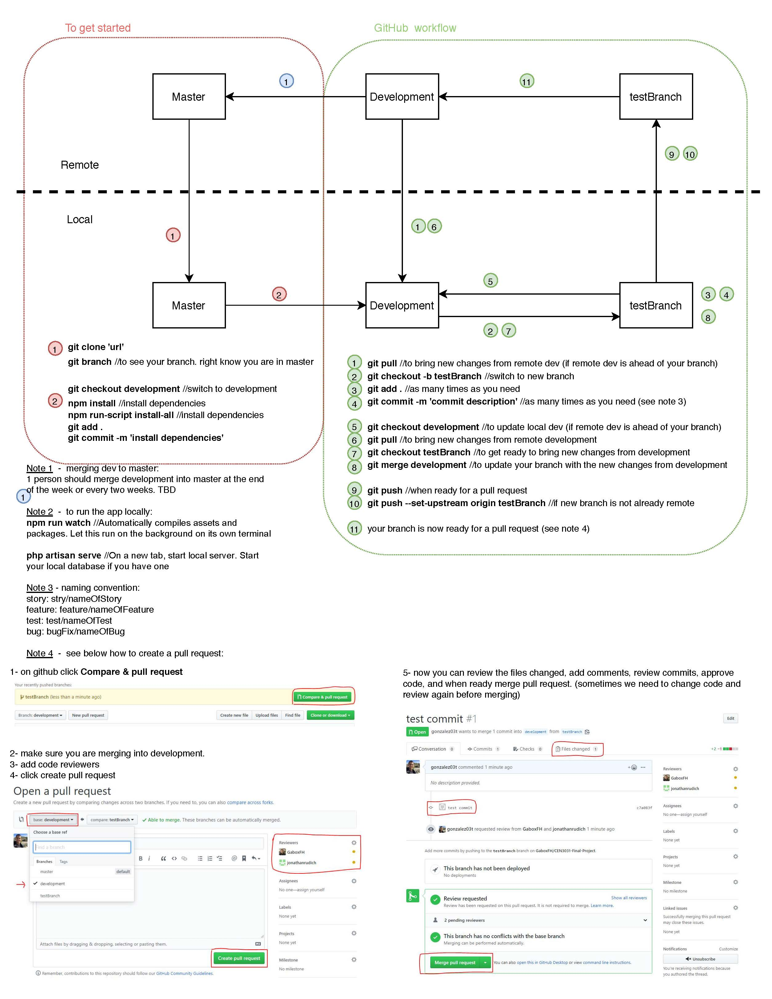

## Development Process

:::tip

This is a tip

:::

As a general guideline, the following steps will be taken in regards to managing the GitHub deployment flow.

1. Define key use cases (look at Asana tasks)
1. Pull from development branch
1. Create a branch to work on a feature / bug fix
1. Make changes / write code
1. Pull from development branch to merge your code locally
1. Integration Testing
1. Make a Request for a Pull (pull request) to the development branch
1. Perform code review to ensure functionality and quality
1. At the end of a sprint merge development branck to master.
1. Push to Heroku 

[Download this PDF](./assets/GitHub_Workflow.pdf)

